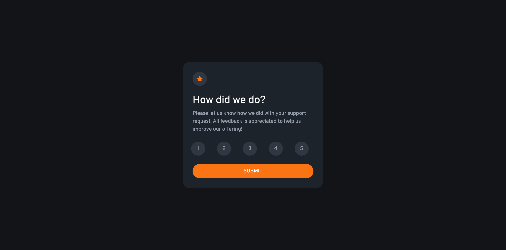

# Frontend Mentor - Interactive rating component solution

This is a solution to the [Interactive rating component challenge on Frontend Mentor](https://www.frontendmentor.io/challenges/interactive-rating-component-koxpeBUmI). Frontend Mentor challenges help you improve your coding skills by building realistic projects.

## Table of contents

- [Overview](#overview)
  - [Screenshot](#screenshot)
  - [Links](#links)
- [My process](#my-process)
  - [Built with](#built-with)
- [Author](#author)

## Overview

### Screenshot

### Links

- Solution URL: [solution](https://github.com/nguyensylvie/interactive-rating)
- Live Site URL: [live site](https://nguyensylvie.github.io/interactive-rating)

## My process

### Built with

- HTML
- SASS
- JS
- Bootstrap

## Author

- Frontend Mentor - [@nguyensylvie](https://www.frontendmentor.io/profile/nguyensylvie)
